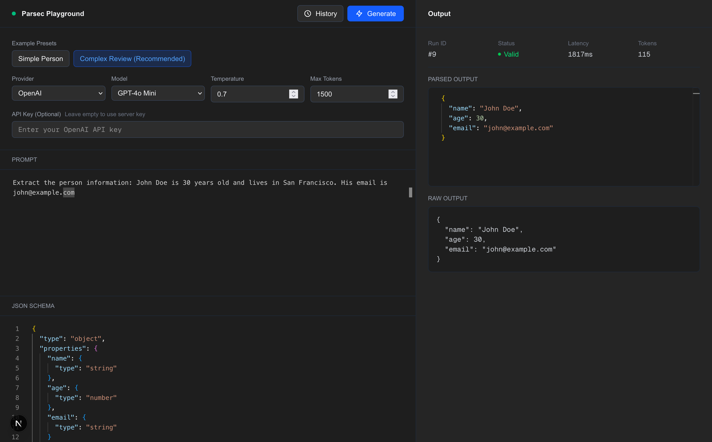

# Parsec Playground



A modern web-based playground for testing and experimenting with [Parsec](https://github.com/BeastByteAI/parsec) - an LLM orchestration toolkit for structured output with schema enforcement and validation.

## What is Parsec Playground?

Parsec Playground is an interactive development environment that allows you to:

- **Test LLM Prompts** with structured JSON schema validation
- **Compare Providers** - Support for OpenAI and Anthropic models
- **Real-time Validation** - Instant feedback on schema compliance with retry enforcement
- **History Tracking** - Browse and reload previous prompts and results
- **Performance Metrics** - Monitor latency, token usage, and validation status
- **Secure API Keys** - Use your own API keys or configure server-side defaults


## Features

### 🎨 Clean Dark Mode UI
Cursor-inspired interface with Monaco Editor for syntax highlighting and code editing.

### 🔄 Schema Enforcement
Parsec's `EnforcementEngine` automatically retries failed validations, ensuring your LLM outputs always match your JSON schema.

### 📊 Analytics Dashboard
Track success rates, latency percentiles (p50, p95, p99), and error breakdowns across all your runs.

### 🔐 Flexible Authentication
- Use server-configured API keys for quick testing
- Provide your own API keys for production use
- Keys are never stored, only passed per-request

### 📜 Full History
Browse all past generations with filtering by provider, model, and validation status. Click any historical run to reload it into the editor.

## Architecture

### Backend (FastAPI + Python)
- **FastAPI** REST API with WebSocket support for streaming
- **SQLAlchemy** ORM with SQLite for data persistence
- **Parsec** integration for LLM orchestration and validation
- **Pydantic** schemas for request/response validation

### Frontend (Next.js + TypeScript)
- **Next.js 16** with App Router
- **TypeScript** for type safety
- **Tailwind CSS** for styling
- **Monaco Editor** for code editing
- **Axios** for API communication

## Tech Stack

**Backend:**
- Python 3.13
- FastAPI
- Parsec (EnforcementEngine, JSONValidator)
- SQLAlchemy + SQLite
- OpenAI & Anthropic adapters

**Frontend:**
- Next.js 16
- TypeScript
- Tailwind CSS
- Monaco Editor
- Axios

## Getting Started

### Prerequisites
- Python 3.13+
- Node.js 18+
- OpenAI API key (optional: Anthropic API key)

### Backend Setup

```bash
cd api
python -m venv venv
source venv/bin/activate  # On Windows: venv\Scripts\activate
pip install -r requirements.txt

# Create .env file with your API key
echo "OPENAI_API_KEY=your-key-here" > .env

# Run the development server
uvicorn app.main:app --reload --port 8000
```

### Frontend Setup

```bash
cd frontend
npm install

# Create .env.local file
echo "NEXT_PUBLIC_API_URL=http://localhost:8000" > .env.local

# Run the development server
npm run dev
```

The application will be available at `http://localhost:3001`

## API Endpoints

- `POST /api/generate` - Generate structured output with schema validation
- `GET /api/history` - Get paginated run history with filtering
- `GET /api/history/{run_id}` - Get specific run details
- `POST /api/templates` - Create prompt templates
- `GET /api/analytics` - Get analytics and performance metrics
- `WS /api/ws/stream` - WebSocket endpoint for streaming generation

## Usage Example

1. **Select a preset** or write your own prompt
2. **Define a JSON schema** for structured output validation
3. **Configure** provider, model, temperature, and max tokens
4. **Optional:** Add your API key for custom usage
5. **Click Generate** and watch Parsec enforce your schema
6. **View results** with validation status, latency, and token metrics
7. **Access history** to reload previous prompts

## How Parsec Works

Parsec's `EnforcementEngine` wraps your LLM calls with:
1. **Prompt Enhancement** - Adds schema context to your prompt
2. **Generation** - Calls the LLM with your provider/model
3. **Validation** - Checks output against JSON schema
4. **Retry Logic** - Automatically retries on validation failure (up to 3 times)
5. **Metrics** - Tracks latency, tokens, and retry count

## Project Structure

```
parsec-playground/
├── api/                    # FastAPI backend
│   ├── app/
│   │   ├── db/            # Database models and config
│   │   ├── models/        # Pydantic schemas
│   │   ├── routes/        # API endpoints
│   │   ├── services/      # LLM and streaming services
│   │   └── main.py        # FastAPI application
│   └── requirements.txt
│
├── frontend/              # Next.js frontend
│   ├── app/              # Next.js app router
│   ├── lib/              # API client and types
│   └── package.json
│
└── assets/               # Screenshots and media
```

## Contributing

Contributions are welcome! Please feel free to submit a Pull Request.

## License

MIT

## Acknowledgments

Built with [Parsec](https://github.com/BeastByteAI/parsec) by BeastByte AI
